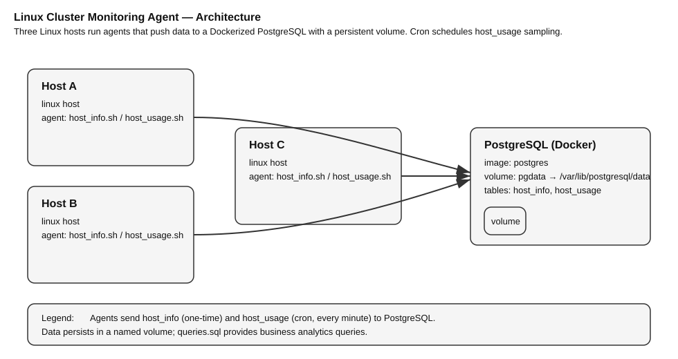

# Linux Cluster Monitoring Agent

# Introduction
This project implements a lightweight monitoring agent for a small Linux cluster. Each host runs Bash scripts that capture (1) static hardware specifications and (2) minute-level resource usage, then store the results in a centralized PostgreSQL database running in Docker. Target users are SRE/DevOps learners and junior engineers who need an auditable, minimal-dependency pipeline for capacity planning and troubleshooting. Core technologies: Bash, cron, Docker, PostgreSQL, Git/GitFlow, and standard GNU tools (`lscpu`, `vmstat`, `df`, `awk`). The design emphasizes reproducibility (scripted DB bootstrap), idempotence (safe re-runs), portability (no long-running agents), and clear ownership between ingestion scripts and SQL schema.

---

# Quick Start

```bash
# 0) Repo layout (key paths)
#   ./scripts/psql_docker.sh   # dockerized Postgres lifecycle
#   ./scripts/host_info.sh     # one-time hardware specs ingestion
#   ./scripts/host_usage.sh    # periodic usage ingestion (cron)
#   ./sql/ddl.sql              # DDL to create tables
#   ./sql/queries.sql          # sample analytical queries

# 1) Start a psql instance using psql_docker.sh
cd linux_sql
bash ./scripts/psql_docker.sh create <DB_USER> <DB_PASS>   # first time
bash ./scripts/psql_docker.sh start                        # subsequent boots

# 2) Create tables using ddl.sql (after creating DB once)
psql -h localhost -U <DB_USER> -W -c "CREATE DATABASE host_agent;"
PGPASSWORD=<DB_PASS> psql -h localhost -U <DB_USER> -d host_agent -f sql/ddl.sql

# 3) Insert hardware specs data (run once per host)
./scripts/host_info.sh "localhost" 5432 "host_agent" "<DB_USER>" "<DB_PASS>"

# 4) Insert one usage sample manually
bash ./scripts/host_usage.sh "localhost" 5432 "host_agent" "<DB_USER>" "<DB_PASS>"

# 5) Crontab setup (collect usage every minute)
crontab -e
# Add the line below (adjust absolute path and credentials):
* * * * * bash /ABS/PATH/linux_sql/scripts/host_usage.sh localhost 5432 host_agent <DB_USER> <DB_PASS> >>/tmp/host_usage.log 2>&1
```
# Implemenation
Discuss how you implement the project.

## Architecture


Three Linux hosts run ingestion agents; a single Dockerized PostgreSQL receives data and persists it on a named volume. `host_info.sh` seeds static specs; `host_usage.sh` appends time-series rows via cron.

## Scripts
Shell script description and usage (use markdown code block for script usage)

### psql_docker.sh
**Purpose:** Provision/manage Dockerized PostgreSQL with a named volume for persistence.  
**Interface:** `create | start | stop`  
**Usage:**
```bash
bash scripts/psql_docker.sh create <DB_USER> <DB_PASS>
bash scripts/psql_docker.sh start
bash scripts/psql_docker.sh stop
```

### host_info.sh
**Purpose:** Parse hostname, CPU (count/arch/model/MHz), L2 cache, total mem; insert one row into host_info (unique on hostname).  
**Interface:** `create | start | stop`  
**Usage:**
```bash
./scripts/host_info.sh psql_host psql_port db_name psql_user psql_password
# Example
./scripts/host_info.sh "localhost" 5432 "host_agent" "postgres" "mypassword"
```
### host_usage.sh
**Purpose:** Capture memory_free, cpu_idle, cpu_kernel, disk_io, disk_available; insert into host_usage with FK lookup by hostname.  
**Interface:** `create | start | stop`  
**Usage:**
```bash
bash scripts/host_usage.sh psql_host psql_port db_name psql_user psql_password
# Example
bash scripts/host_usage.sh localhost 5432 host_agent postgres mypassword
```
### crontab
**Purpose:** Automate minute-level sampling with no resident daemon.  
**Entry:**
```bash
* * * * * bash /ABS/PATH/linux_sql/scripts/host_usage.sh localhost 5432 host_agent <DB_USER> <DB_PASS>
```

### queries.sql
**Business Purpose:**  
Identify lowest-memory hosts for remediation.  
Trend CPU idle to detect hot spots / noisy neighbors. 
Track / free space to anticipate capacity incidents. 

## Database Modeling
Describe the schema of each table using markdown table syntax (do not put any sql code)

### `host_info`
| Column           | Type      | Null | Notes                     |
|------------------|-----------|------|---------------------------|
| id               | SERIAL    | NO   | Primary key               |
| hostname         | VARCHAR   | NO   | FQDN; **UNIQUE**          |
| cpu_number       | INT2      | NO   | Logical CPUs              |
| cpu_architecture | VARCHAR   | NO   | e.g., `x86_64`            |
| cpu_model        | VARCHAR   | NO   | e.g., `Intel(R) Xeon(R)?` |
| cpu_mhz          | FLOAT8    | NO   | Avg/base MHz              |
| l2_cache         | INT4      | NO   | KB                        |
| total_mem        | INT4      | YES  | MB                        |
| timestamp        | TIMESTAMP | YES  | Ingest time (UTC)         |

### `host_usage`
| Column         | Type      | Null | Notes                |
|----------------|-----------|------|----------------------|
| timestamp      | TIMESTAMP | NO   | Sample time (UTC)    |
| host_id        | INT       | NO   | FK ? `host_info(id)` |
| memory_free    | INT4      | NO   | MB                   |
| cpu_idle       | INT2      | NO   | Percent              |
| cpu_kernel     | INT2      | NO   | Percent              |
| disk_io        | INT4      | NO   | I/O count            |
| disk_available | INT4      | NO   | MB free on `/`       |

# Test
- **Script validation:** Ran both scripts with echo/preview to verify parsing, quoting, and SQL composition.
- **Schema checks:** Re-ran `host_info.sh` to confirm `UNIQUE(hostname)` prevents duplicates; validated the FK in `host_usage`.
- **Data sanity:** Queried last N minutes of `host_usage` to confirm cron appended exactly one row per minute; compared spot values with `vmstat` / `df`.

# Deployment
- **Source control:** Git/GitFlow on GitHub (`feature/*` ? `develop` ? PR ? `main`).
- **Database:** Dockerized PostgreSQL managed via `psql_docker.sh` with a persistent volume.
- **Agents:** Bash scripts deployed to hosts; credentials via CLI using `PGPASSWORD`.
- **Automation:** Linux `crontab` schedules minute-level ingestion.

# Improvements
- Track hardware changes over time (add specs history table with effective dates).
- Portability hardening (fallback to `/proc` parsing; locale-safe parsing; better exit codes/logging).
- Observability: add dashboards/alerts (Grafana/Metabase + scheduled queries).
- Security: `.pgpass` / env-file secrets; least-privileged DB role and rotation.
- Data lifecycle: retention policy + nightly rollups (hour/day aggregates) for long-term trends.
