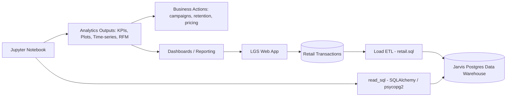

# Introduction

LGS is an online retail business that operates a web app to sell gift-style products. Like most e-commerce companies, LGS accumulates a large amount of transactional data (invoices, customers, quantities, unit prices, cancellations). The business challenge is turning these raw transactions into actionable insights—understanding when revenue is increasing or dropping, how customer activity changes over time, and which customer segments contribute the most value.

In practice, LGS would use the analytics results from this project to support revenue growth decisions, such as:
- Monitoring monthly sales trends and seasonality to plan promotions and staffing
- Tracking placed vs. canceled orders to reduce revenue leakage and improve operations
- Identifying customer activity patterns (monthly active users, new vs. returning customers)
- Applying RFM-style segmentation to target high-value customers, re-activate lapsed customers, and personalize marketing campaigns

My work in this project covered both learning and implementation:
- Learning tickets: practiced Python/Jupyter fundamentals, NumPy/Pandas operations, missing value handling, basic statistics, and visualization (supported by `grades.csv` and `data_wrangling_learning.ipynb`).
- SQL ticket: explored the retail table inside the Jarvis Postgres data warehouse using SQL (`psql/data_explore.sql`), including schema inspection and key business queries (record counts, unique customers, invoice date range, revenue, and monthly revenue).
- Data Analytics ticket: built an end-to-end retail analytics notebook (`retail_data_analytics_wrangling.ipynb`) using Python (Pandas/NumPy/Matplotlib) and database connectivity (psycopg2 + SQLAlchemy) to load data and produce KPI metrics, time-series features, plots, and an RFM-style customer value view.

# Implementation

## Project Architecture

This project connects an operational retail dataset to a Postgres-based data warehouse (Jarvis PSQL) and then uses a Python/Jupyter analytics layer to generate business metrics and customer segmentation outputs. The LGS web app is the producer/consumer of the business workflow: it generates transactions and benefits from analytics results (dashboards, marketing segmentation, and KPI monitoring).

### Architecture Diagram

Notes:
- `retail.sql` is the instructor-provided SQL used to define/load the retail dataset in the warehouse.
- `psql/data_explore.sql` contains my exploratory SQL queries to validate table contents and compute basic business metrics.
- The analytics notebook reads from the warehouse and/or CSV sources, computes features, and produces plots and KPI tables.

## Data Analytics and Wrangling

Notebook link:
- [Retail Data Analytics Notebook](./retail_data_analytics_wrangling.ipynb)

In the notebook, I implemented the analytics workflow using:
- **Database connectivity:** `psycopg2` + `SQLAlchemy` to connect to Jarvis Postgres and load the `retail` table into Pandas (e.g., `pd.read_sql`, `pd.read_sql_query`, `pd.read_sql_table`).
- **Data wrangling:** Pandas transformations to build derived fields such as invoice-level amounts (`quantity * unit_price`), monthly keys (`YYYYMM`), and cancellation flags.
- **Visualization:** Matplotlib plots for invoice amount distribution (full data and trimmed to the first 85% quantile) and monthly trend charts.
- **Analytics outputs:**
    - invoice-level totals and their distribution (including an outlier-trimmed view),
    - business KPIs such as total orders, unique customers, unique SKUs, total revenue, and monthly revenue (`YYYYMM`),
    - time-series features including monthly placed vs. canceled orders, monthly sales and sales growth, and monthly active users,
    - customer lifecycle views such as new vs. existing users,
    - an RFM-style customer value view based on Recency/Frequency/Monetary segmentation.

### How the analytics can help LGS increase revenue

Based on the metrics produced in the notebook, LGS can design concrete revenue strategies such as:

1) **Retention & win-back campaigns (RFM-driven)**
- Use RFM segmentation to identify:
    - High-value loyal customers (high frequency + high monetary): offer VIP perks, early access, bundles, or loyalty rewards to increase repeat purchases.
    - At-risk customers (high past value but no recent purchases): win-back offers, personalized recommendations, and time-limited coupons to reduce churn.
    - New customers: onboarding sequences to encourage a second purchase quickly (email series, discount on next order, complementary product suggestions).

2) **Reduce cancellation impact**
- Track monthly canceled vs. placed orders to quantify revenue leakage.
- Investigate cancellation spikes (product quality, delivery delays, unclear product descriptions).
- Improve product messaging, fulfillment processes, or customer service workflows to reduce refunds/cancellations and protect realized revenue.

3) **Seasonality-aware marketing and inventory planning**
- Use monthly sales and sales growth to detect seasonality and plan promotions.
- If growth slows in specific months, run targeted campaigns to the highest-conversion segments and adjust inventory or pricing accordingly.

4) **Customer lifecycle tracking**
- Use new vs. returning user metrics to understand whether growth is acquisition-led or retention-led.
- If new-user acquisition is strong but returning users are weak, prioritize post-purchase engagement (loyalty program, reorder reminders, personalized offers).

# Improvements

If I had more time, I would implement these improvements:

1) **Automate and productionize the workflow**
- Convert the notebook workflow into modular Python scripts with a single CLI entry point (e.g., `python -m src.run_all`) and schedule regular refresh runs (cron/Airflow) so LGS can monitor KPIs continuously.

2) **Stronger data quality checks and a clearer data model**
- Add validation rules before analytics (duplicate invoice lines, negative/zero prices, invalid quantities, consistent cancellation handling).
- Formalize a star-schema style model (fact invoices + dimensions for customer/product/date) to make downstream analytics more reliable and maintainable.

3) **Deliver a reporting layer that the LGS web app can consume**
- Build a lightweight dashboard (e.g., Streamlit) or provide a small set of DB views/materialized views so the web app can display KPI cards, trend charts, and customer segment counts without manually running notebooks.
